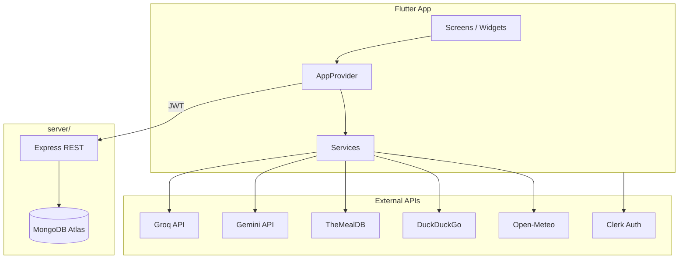

# AGENT.md — Harvest & Hearth Developer Guide

> Tài liệu tham chiếu chi tiết cho **developer** và **AI agent** khi đọc, sửa, hoặc mở rộng project **Harvest & Hearth Flutter**.
>
> **Phiên bản app:** `1.0.27+28` (`pubspec.yaml`) · **Nhãn sản phẩm gần nhất:** `b0.4.16` (xem `CHANGELOG.md`)

---

## Mục lục

1. [Tổng quan sản phẩm](#1-tổng-quan-sản-phẩm)
2. [Cấu trúc monorepo](#2-cấu-trúc-monorepo)
3. [Tech stack](#3-tech-stack)
4. [Kiến trúc tổng thể](#4-kiến-trúc-tổng-thể)
5. [Khởi động app (`main.dart`)](#5-khởi-động-app-maindart)
6. [Luồng xác thực (Clerk)](#6-luồng-xác-thực-clerk)
7. [Điều hướng & màn hình](#7-điều-hướng--màn-hình)
8. [State management — `AppProvider`](#8-state-management--appprovider)
9. [Phân lớp dữ liệu: Cloud vs Local](#9-phân-lớp-dữ-liệu-cloud-vs-local)
10. [Models](#10-models)
11. [Services (Flutter)](#11-services-flutter)
12. [Widgets tái sử dụng](#12-widgets-tái-sử-dụng)
13. [Theme & i18n](#13-theme--i18n)
14. [Luồng nghiệp vụ chi tiết](#14-luồng-nghiệp-vụ-chi-tiết)
15. [Backend API (`server/`)](#15-backend-api-server)
16. [MongoDB schema](#16-mongodb-schema)
17. [Biến môi trường](#17-biến-môi-trường)
18. [SharedPreferences keys](#18-sharedpreferences-keys)
19. [Android đặc thù](#19-android-đặc-thù)
20. [Quy ước code & patterns](#20-quy-ước-code--patterns)
21. [Hiệu năng đã áp dụng](#21-hiệu-năng-đã-áp-dụng)
22. [Mở rộng / checklist dev](#22-mở-rộng--checklist-dev)
23. [Backlog & hạn chế hiện tại](#23-backlog--hạn-chế-hiện-tại)
24. [File map nhanh](#24-file-map-nhanh)
25. [Sequence diagrams (UML PNG)](#25-sequence-diagrams-uml-png)
26. [Use case diagram (UML PNG)](#26-use-case-diagram-uml-png)

---

## 1. Tổng quan sản phẩm

**Harvest & Hearth** là ứng dụng quản lý thực phẩm thông minh (ưu tiên **Android**):

| Domain | Mô tả |
|--------|--------|
| **Kho (Inventory)** | Tủ lạnh / ngăn đông / pantry; CRUD; quét barcode/QR |
| **Hết hạn** | Cảnh báo UI, local notification ~09:00, Android home widget |
| **Hearthie (AI)** | Chat đa lượt (Groq); gợi ý công thức (Groq → Gemini fallback) |
| **Công thức** | TheMealDB, DummyJSON, DuckDuckGo; lưu cloud |
| **Meal Planner** | Lịch thực đơn theo ngày; shopping list; nhập kho từ mua sắm |
| **Đám mây** | MongoDB qua REST API Node; auth Clerk JWT |
| **Cài đặt** | Việt/Anh, dark mode, nhắc hạn, mặc định ngày hết hạn theo category |

**Ngôn ngữ UI:** `VIE` (mặc định) | `ENG` — qua `Translations.get(key, language)` trong `lib/constants/translations.dart`.

---

## 2. Cấu trúc monorepo

```
harvest-and-hearth-flutter/          ← ROOT — app Flutter CHÍNH
├── lib/                             ← Toàn bộ Dart source (37 files)
├── android/                         ← Android native (widget Kotlin, manifest)
├── ios/, macos/, linux/, windows/, web/  ← Platform scaffold (không phải focus chính)
├── server/                          ← Node.js REST API + Dockerfile
├── clerk/email-templates/           ← HTML Revolvapp cho Clerk Dashboard
├── code/app_icon.png                ← Launcher icon source
├── public/hearthie/hearthie.png     ← Asset mascot Hearthie
├── .env.example                     ← Template env Flutter
├── pubspec.yaml                     ← Dependencies & version
├── README.md                        ← Hướng dẫn người dùng / setup
├── CHANGELOG.md                     ← Lịch sử phiên bản
├── render.yaml                      ← Render Blueprint (deploy API)
├── harvestandhearth/                ← ⚠️ Flutter scaffold TRỐNG (1.0.0+1) — KHÔNG dùng
└── AGENT.md                         ← File này
```

### Thư mục `lib/` chi tiết

```
lib/
├── main.dart                        # Entry, ClerkAuth, MainShell, bottom nav
├── core/
│   └── simulated_clock.dart         # Offset thời gian cho QA expiry
├── constants/
│   ├── translations.dart            # Song ngữ VIE/ENG
│   └── categories.dart              # CategoryTier1, AppCategories
├── models/
│   ├── food_item.dart
│   ├── recipe.dart
│   ├── user.dart
│   ├── chat_message.dart
│   ├── planned_meal_entry.dart      # Planner period day/week (legacy flow)
│   ├── daily_meal_plan.dart         # Planner calendar yyyy-MM-dd
│   └── shopping_plan_item.dart
├── providers/
│   └── app_provider.dart            # ★ Trung tâm state (~1475 dòng)
├── services/
│   ├── backend_api_service.dart     # REST + Clerk JWT
│   ├── groq_chat_service.dart       # Hearthie chat
│   ├── groq_service.dart            # Recipe generation (Groq)
│   ├── gemini_service.dart          # Recipe fallback
│   ├── ai_service.dart              # Facade Groq → Gemini
│   ├── recipe_search_service.dart   # TheMealDB, DummyJSON, DDG
│   ├── translate_service.dart       # Google Translate unofficial
│   ├── weather_service.dart         # Open-Meteo + geolocation
│   ├── expiry_reminder_service.dart # Local notifications
│   └── home_widget_service.dart     # Android widget data bridge
├── screens/
│   ├── auth_screen.dart
│   ├── dashboard_screen.dart
│   ├── inventory_screen.dart
│   ├── recipes_screen.dart
│   ├── profile_screen.dart
│   ├── ai_chat_screen.dart
│   ├── barcode_scanner_screen.dart
│   ├── meal_calendar_planner_screen.dart
│   └── notifications_screen.dart
├── widgets/
│   ├── add_food_modal.dart
│   ├── food_item_card.dart
│   ├── recipe_card.dart
│   └── time_simulator_console.dart
├── theme/
│   └── app_theme.dart
└── utils/
    └── date_helper.dart
```

---

## 3. Tech stack

| Lớp | Công nghệ |
|-----|-----------|
| **UI** | Flutter 3.27+, Material 3, Dart ≥3.6.2 |
| **State** | `provider` — single `AppProvider` (`ChangeNotifier`) |
| **Auth** | Clerk (`clerk_flutter` 0.0.14-beta, `clerk_auth`) |
| **Backend** | Express 4, MongoDB 6, `@clerk/backend` JWT verify |
| **AI Chat** | Groq `openai/gpt-oss-120b` (configurable via `.env`) |
| **AI Recipes** | Groq `meta-llama/llama-4-scout-17b-16e-instruct` → Gemini `gemini-2.0-flash` |
| **Recipe APIs** | TheMealDB, DummyJSON, DuckDuckGo Instant Answer |
| **Local storage** | `shared_preferences` |
| **Notifications** | `flutter_local_notifications` + `timezone` |
| **Widget** | `home_widget` + Kotlin `HarvestWidgetProvider` |
| **Scanner** | `mobile_scanner` |
| **Location** | `geolocator`, `geocoding` (weather) |

---

## 4. Kiến trúc tổng thể



### Nguyên tắc phân tách

| Thành phần | Trách nhiệm |
|------------|-------------|
| **Screens** | UI, `context.watch/read<AppProvider>`, `Navigator.push` |
| **Widgets** | UI tái sử dụng; một số gọi provider |
| **AppProvider** | State, orchestration, persist local, gọi services |
| **Services** | HTTP/AI/platform; singleton `instance` |
| **Models** | Immutable data + `fromJson`/`toJson`/`fromApiRow` |
| **server/** | Persistence cloud, Clerk auth gate |

---

## 5. Khởi động app (`main.dart`)

### Thứ tự `main()`

```
WidgetsFlutterBinding.ensureInitialized()
  → dotenv.load('.env')           // fail silent nếu thiếu file
  → ExpiryReminderService.init()  // timezone, notification channels
  → BackendApiService.configure(API_BASE_URL)
  → runApp(ChangeNotifierProvider → ClerkAuth hoặc _MissingClerkKeyApp)
```

### Cây widget sau khi có Clerk key

```
ChangeNotifierProvider<AppProvider>
  └── ClerkAuth
        └── HarvestAndHearthApp
              └── Selector<AppProvider, _AppUiState>  // chỉ isDark + isInitialized
                    └── MaterialApp
                          ├── !isInitialized → _SplashScreen
                          └── ClerkAuthBuilder
                                ├── signedOut → _SignedOutShell → AuthScreen
                                └── signedIn → _ClerkBootstrap → MainShell
```

### `_ClerkBootstrap`

1. Post-frame: `AppProvider.bindClerkSession(ClerkAuth, clerk.User)`
2. Chờ `!isLoadingUser && user != null` → hiện `MainShell`

### `MainShell`

- `IndexedStack` 4 tab (giữ state từng tab):
  - `0` DashboardScreen
  - `1` InventoryScreen
  - `2` RecipesScreen
  - `3` ProfileScreen
- FAB center-docked → `AddFoodModal`
- `TimeSimulatorFab` (góc trái) nếu `isTimeSimulatorFabVisible()`
- Lắng nghe `ExpiryReminderService.tapPayloadStream` → chuyển tab 0 khi tap notification `expiry:*`

### Theme tĩnh

```dart
final ThemeData kAppLightTheme = buildAppTheme(isDark: false);
final ThemeData kAppDarkTheme = buildAppTheme(isDark: true);
```

`MaterialApp` **không** rebuild khi inventory/recipes thay đổi — chỉ khi `isDark` hoặc `isInitialized` đổi.

---

## 6. Luồng xác thực (Clerk)


*Sơ đồ đầy đủ (alt upsert profile, từng API call): [`docs/sequence-diagrams/01-clerk-login.mmd`](docs/sequence-diagrams/01-clerk-login.mmd)*

### Sign-out (`clearSession`)

Xóa: user, inventory, recipes, chat, planner local state, notification logs cache; `GroqChatService.clearHistory()`; `SimulatedClock.reset()`; `BackendApiService.detach()`; cancel notifications + clear widget.

### Tài khoản thử

Nếu `.env` có **cả** `TEST_ACCOUNT_EMAIL` và `TEST_ACCOUNT_PASSWORD` → `AuthScreen` hiện nút copy thông tin (SDK Clerk không cho auto-fill form).

---

## 7. Điều hướng & màn hình

### Shell navigation (tab cố định)

| Index | Screen | File |
|-------|--------|------|
| 0 | Trang chủ | `dashboard_screen.dart` |
| 1 | Kho | `inventory_screen.dart` |
| 2 | Công thức | `recipes_screen.dart` |
| 3 | Hồ sơ | `profile_screen.dart` |

### Push navigation (stack)

| Từ | Đến | Trigger |
|----|-----|---------|
| Dashboard | `AiChatScreen` | Card Hearthie / quick action |
| Dashboard | `BarcodeScannerScreen` | Quick action quét mã |
| Dashboard | `MealCalendarPlannerScreen` | Quick action lịch thực đơn |
| Dashboard | `RecipesScreen` | Quick action gợi ý AI |
| Dashboard | `AddFoodModal` | Sheet thêm món |
| Recipes | `AiChatScreen` | Tab AI |
| Recipes | `MealCalendarPlannerScreen` | Tab planner |
| Profile | `NotificationsScreen` | Notification center |
| Profile | `_InventoryDefaultsScreen` | Mặc định ngày hết hạn |
| AddFoodModal | `BarcodeScannerScreen` | Nút quét trong modal |
| AiChatScreen | `MealCalendarPlannerScreen` | Deep link từ chat (meal plan intent) |

### `dashboard_screen.dart` — sections chính

- `_WelcomeBanner` + weather (`WeatherService`)
- `_StatsRow` — tổng món, sắp hết hạn, hết hạn, còn tốt
- `_QuickActionGrid` — thêm, quét, gợi ý, lịch
- `_AiChatPreviewCard` → `AiChatScreen`
- `_AlertsCard` — expired + expiring soon
- `_RealtimeRecipeSuggestionsCard` — gọi `AiService.generateRecipes`
- `_RecentItemsList`, `_TipCard`
- Ẩn bớt UI khi `AppProvider.isDemoMode` (`DEMO_MODE=true` trong `.env`)

### `inventory_screen.dart`

- Tab: Tủ lạnh | Ngăn đông | Pantry (`StorageType`)
- Sort: name | expiry | added
- `FoodItemCard` với badge shopping plan

### `recipes_screen.dart`

- Tab: **Gợi ý AI** | **Đã lưu** | **Khám phá**
- Khám phá: TheMealDB VN dishes + DuckDuckGo search
- Dịch qua `TranslateService` khi `language == VIE`

### `ai_chat_screen.dart`

- List bubble + typing indicator
- Quick prompts từ `GroqChatService.getQuickPrompts`
- Retry / regenerate / clear chat
- Import shopping plan từ nội dung chat (`importShoppingPlanFromChat`)

### `meal_calendar_planner_screen.dart`

- Calendar view + agenda theo ngày chọn
- FAB thêm món → search TheMealDB/DummyJSON → preview recipe → chọn slot (breakfast/lunch/dinner)
- Sheet shopping: generate list từ daily plans, đánh dấu đã mua, confirm → `addPurchasedItemsToInventory`

### `profile_screen.dart`

- Language, dark mode, expiry reminders toggle
- Links: notifications, inventory defaults, about, logout (`ClerkAuth.signOut`)

---

## 8. State management — `AppProvider`

**File:** `lib/providers/app_provider.dart`  
**Pattern:** Một `ChangeNotifier` tập trung — **chưa tách** theo domain.

### State fields

| Field | Type | Mô tả |
|-------|------|--------|
| `_user` | `AppUser?` | Profile sau Clerk + API |
| `_inventory` | `List<FoodItem>` | Kho (sync cloud) |
| `_savedRecipes` | `List<Recipe>` | Công thức đã lưu (cloud) |
| `_recipeCache` | `List<Recipe>` | Cache tạm UI (AI suggestions) |
| `_language` | `String` | `VIE` \| `ENG` |
| `_isDark` | `bool` | Theme |
| `_expiryRemindersEnabled` | `bool` | Local notification |
| `_notificationLogs` | `List<Map>` | Cache từ API |
| `_defaultExpiryDaysByCategory` | `Map<String,int>` | Mặc định hết hạn |
| `_shoppingPlanItems` | `List<ShoppingPlanItem>` | **Local only** |
| `_plannedMeals` | `List<PlannedMealEntry>` | **Local only** (period day/week) |
| `_dailyMealPlans` | `List<DailyMealPlan>` | **Local only** (calendar) |
| `_shoppingPlanPeriod` | `String` | `day` \| `week` |
| `_chatMessages` | `List<ChatMessage>` | UI chat session |
| `_chatCache` | in-memory | Cache câu trả lời tương tự |

### Public API nhóm theo domain

#### Lifecycle / Auth
- `init()` — load SharedPreferences
- `bindClerkSession(auth, user)` — attach API, load cloud data
- `clearSession()` — sign-out cleanup
- `logout(auth)` — Clerk signOut + clearSession

#### Inventory
- `addFood`, `removeFood`, `updateFood`
- Getters: `fridgeItems`, `freezerItems`, `pantryItems`, `expiredItems`, `expiringSoonItems`
- `setDefaultExpiryDaysFor(category, days)`

#### Recipes
- `saveRecipe`, `unsaveRecipe`, `isRecipeSaved`
- `setRecipeCache`

#### Settings
- `setLanguage`, `toggleTheme`
- `setExpiryRemindersEnabled`
- `applySimulatedTime()` — sau khi đổi `SimulatedClock`

#### Notifications
- `refreshNotificationLogs`, `markNotificationLogRead`

#### Shopping / Planner (local-first)
- `generateShoppingPlan({weekly})` — rule-based theo category deficit
- `addPlannedMeal`, `removePlannedMeal`, `clearPlannedMealsForActivePeriod`
- `saveShoppingDraft`, `setShoppingConfirmedQty`, `setShoppingPurchased`, `clearShoppingPlan`
- `generateShoppingFromDailyMealPlans({weekly, deductInventory})`
- `addPurchasedItemsToInventory({useHearthieClassification})`
- `importShoppingPlanFromChat(content)`
- `upsertDailyMealPlan`, `removeDailyMealPlan`, `clearDailyPlansForDate`
- Helpers: `dailyPlansForDate`, `dailyPlansByDate`, `dailyPlansInRange`

#### AI Chat
- `sendChatMessage`, `retryLastChatMessage`, `regenerateLastChatResponse`, `clearChat`

### Inventory mutation pattern

```
1. Cập nhật _inventory trong memory
2. notifyListeners()
3. Nếu có user + API configured → BackendApiService insert/update/delete
4. _scheduleAlerts() → ExpiryReminderService.syncInventory + HomeWidgetService.update
```

Lỗi API: log `debugPrint`, **không rollback** UI (optimistic local).

### `_safeApiCall`

Wrapper try/catch cho API phụ (notifications, saved recipes) — fail → empty list, không crash app.

---

## 9. Phân lớp dữ liệu: Cloud vs Local

| Dữ liệu | Lưu trữ | Ghi chú |
|---------|---------|---------|
| Profile (name, email, language, is_dark) | MongoDB `profiles` | JWT = Clerk `sub` |
| Food items | MongoDB `food_items` | Include planner badges |
| Saved recipes | MongoDB `saved_recipes` | `recipe_data` JSON blob |
| Notification logs | MongoDB `notifications` | App ghi khi gửi local notif |
| Language, isDark (prefs) | SharedPreferences | Sync lên profile khi load user |
| Shopping plan, planned meals, daily meal plans | SharedPreferences | **Chưa sync cloud** |
| Chat history (Groq) | In-memory `GroqChatService._history` | Mất khi clear/restart |
| Chat UI messages | `AppProvider._chatMessages` | Session only |
| Expiry reminder enabled | SharedPreferences | Key: `expiry_reminders_enabled` |
| Default expiry by category | SharedPreferences | JSON map |

---

## 10. Models

### `FoodItem` (`food_item.dart`)

| Field | Type | Notes |
|-------|------|-------|
| `id` | `String` | UUID client-generated |
| `name` | `String` | |
| `category` | `FoodCategory` enum | vegetables, fruits, meat, … |
| `storage` | `StorageType` | fridge, freezer, pantry |
| `quantity` | `double` | |
| `unit` | `String` | |
| `addedDate` | `DateTime` | |
| `expiryDate` | `DateTime?` | |
| `warningDays` | `int?` | default threshold 3 |
| `fromShoppingPlan` | `bool` | Badge nguồn |
| `shoppingPlanMealNames` | `List<String>` | Badge món liên quan |
| `planSourceLabel` | `String?` | Label hiển thị |

**Computed (dùng `SimulatedClock.now`):**
- `daysUntilExpiry` — null nếu không có expiry
- `isExpired` — `daysUntilExpiry < 0`
- `isExpiringSoon` — `0 <= days <= (warningDays ?? 3)`

**Serializers:**
- `fromApiRow` — snake_case từ REST
- `fromJson` — camelCase local

### `Recipe` (`recipe.dart`)

Fields: id, name, description, difficulty, prepTime, cookTime, servings, calories, ingredientsNeeded, instructions, sourceName, sourceUrl, imageKeyword, isSaved.

`normalizeRecipeInstructions()` — loại bỏ prefix "Bước 1", dedupe.

### `AppUser` (`user.dart`)

`id`, `email`, `name`, `avatarUrl`

### `ChatMessage` (`chat_message.dart`)

`ChatRole`: user | assistant | system

### `PlannedMealEntry`

Planner flow **period-based** (day/week): recipeId, recipeName, ingredients, period, dayKey (`day` | `mon`..`sun`), mealSlot (`breakfast`|`lunch`|`afternoon`|`dinner`).

### `DailyMealPlan`

Planner **calendar**: `dateKey` (`yyyy-MM-dd`), mealSlot (`breakfast`|`lunch`|`dinner`), recipe metadata, ingredients.

Helper: `mealDateKey(DateTime)` → `"yyyy-MM-dd"`.

### `ShoppingPlanItem`

`requiredQty`, `confirmedQty`, `isPurchased`, `planMealRefs` (tên món liên quan).

---

## 11. Services (Flutter)

### `BackendApiService` (singleton)

- `configure(baseUrl)` — strip trailing `/`
- `attach(ClerkAuthState)` / `detach()` — JWT via `sessionToken()`
- Timeout: **45s** (Render cold start)
- Reused `http.Client` cho connection pooling

| Method | HTTP |
|--------|------|
| `getProfile` | GET `/api/v1/profile` |
| `upsertProfile` / `updateProfileSettings` | PUT `/api/v1/profile` |
| `getFoodItems` | GET `/api/v1/food-items` |
| `insertFoodItem` / `insertFoodItems` | POST `/api/v1/food-items` |
| `updateFoodItem` | PATCH `/api/v1/food-items/:id` |
| `deleteFoodItem` | DELETE `/api/v1/food-items/:id` |
| `getSavedRecipes` | GET `/api/v1/saved-recipes` |
| `saveRecipe` | POST `/api/v1/saved-recipes` |
| `unsaveRecipe` | DELETE `/api/v1/saved-recipes/:originalId` |
| `getNotificationLogs` | GET `/api/v1/notifications?limit&skip` |
| `createNotificationLog` | POST `/api/v1/notifications` |
| `setNotificationLogRead` | PATCH `/api/v1/notifications/:id/read` |

### `GroqChatService` — Hearthie chat

- Endpoint: `https://api.groq.com/openai/v1/chat/completions`
- Model: `GROQ_CHAT_MODEL` hoặc default `openai/gpt-oss-120b`
- System prompt inject **toàn bộ inventory** + expiry context
- `_history` max 16 messages; `sendMessage` append user + assistant
- Meal planning intent → enrich với `RecipeSearchService` (TheMealDB, DummyJSON, trusted DDG)
- `getQuickPrompts(language, inventory)` — dynamic theo kho

### `GroqService` — recipe generation

- Model: `GROQ_RECIPE_MODEL` hoặc `meta-llama/llama-4-scout-17b-16e-instruct`
- Prompt JSON strict → parse 3 recipes

### `GeminiService` — fallback recipes

- `google_generative_ai` package
- Cùng contract JSON như Groq

### `AiService` — facade

```
try GroqService.generateRecipes
catch → try GeminiService.generateRecipes
catch → throw groqError
```

### `RecipeSearchService`

| API | Usage |
|-----|--------|
| TheMealDB | `getVietnameseDishes`, `searchMeals`, `getMealById` → full `Recipe` |
| DummyJSON | `recipes/search`, Vietnamese filter |
| DuckDuckGo | Instant Answer, trusted domains whitelist |

`MealSummary` — lightweight list; `DdgResult` — title/snippet/url.

### `TranslateService`

Unofficial Google Translate HTTP — dịch tên/mô tả recipe khi UI VIE.

### `WeatherService`

1. GPS (`geolocator`) → reverse geocode
2. Fallback IP geolocation
3. Open-Meteo forecast → `WeatherSnapshot`
4. Dashboard banner: day/night/rain theming

### `ExpiryReminderService` (singleton)

**Channels Android:**
- `harvest_expiry` — daily summary 09:00
- `harvest_expiry_urgent` — expired items immediate (debounced per day)
- `harvest_expiry_immediate` — simulator test

**Payloads:** `expiry:summary`, `expiry:urgent`, `expiry:simulator`

**Flow `syncInventory(items, language, userId)`:**
1. Cancel/reschedule daily summary nếu có expiring/expired
2. Urgent notification nếu có expired (1 lần/ngày)
3. Ghi log lên MongoDB qua `createNotificationLog` (types: `expiry_summary`, `expiry_urgent`, `expiry_test`)

### `HomeWidgetService`

Android only — `HomeWidget.saveWidgetData` keys: `line1`, `expiring_count`, `expired_count`, `status_text`, `line2`, …  
Trigger `HarvestWidgetProvider` update.

---

## 12. Widgets tái sử dụng

| Widget | File | Vai trò |
|--------|------|---------|
| `AddFoodModal` | `add_food_modal.dart` | Form thêm/sửa food; barcode; category/storage picker |
| `FoodItemCard` | `food_item_card.dart` | Card inventory + expiry badge + plan badges |
| `RecipeCard` | `recipe_card.dart` | Card recipe + detail sheet |
| `TimeSimulatorFab` | `time_simulator_console.dart` | +N days → `SimulatedClock` + test notification |

---

## 13. Theme & i18n

### `app_theme.dart`

- `AppColors` — green/orange borders, Hearthie gold/sky/night
- `AppRadii`, `AppSpacing` — design tokens
- `buildAppTheme({isDark})` — `ColorScheme.fromSeed`, custom cards, FAB, nav

### `translations.dart`

- `Translations.get(key, language)` — map key → VIE/ENG string
- Dùng `provider.t('key')` trong UI
- Widget strings: `widget_line1`, `widget_status_danger`, …

### `categories.dart`

- `CategoryTier1` — produce, protein, pantry, …
- `AppCategories` — metadata hiển thị + mapping `FoodCategory`

---

## 14. Luồng nghiệp vụ chi tiết

### 14.1 Thêm thực phẩm


*Source: [`docs/sequence-diagrams/02-add-food.mmd`](docs/sequence-diagrams/02-add-food.mmd)*

- Expiry mặc định: `defaultExpiryDaysByCategory[category]` hoặc user chọn manual
- `addedDate` = `SimulatedClock.now`

### 14.2 Gợi ý công thức (Dashboard / Recipes)


*Source: [`docs/sequence-diagrams/03-ai-recipe-suggestion.mmd`](docs/sequence-diagrams/03-ai-recipe-suggestion.mmd) — khung **alt** Groq thành công / fallback Gemini.*

User save → `saveRecipe` → POST `/saved-recipes`.

### 14.3 Hearthie Chat


*Source: [`docs/sequence-diagrams/04-hearthie-chat.mmd`](docs/sequence-diagrams/04-hearthie-chat.mmd) — khung **alt** cache HIT vs MISS.*

- `regenerateLastChatResponse`: `forceRefresh: true`, `preferAlternative: true`
- `retryLastChatMessage`: xóa user message failed, gửi lại

### 14.4 Meal Calendar Planner (flow chính hiện tại)


*Source: [`docs/sequence-diagrams/05-meal-plan-shopping-inventory.mmd`](docs/sequence-diagrams/05-meal-plan-shopping-inventory.mmd) — 3 phase (rect) + **alt** AI classify / fallback.*

### 14.5 Shopping plan (period day/week — flow phụ)

- `generateShoppingPlan` — targets cố định theo `FoodCategory`, so sánh với inventory
- `addPlannedMeal` — gắn món + slot vào `_plannedMeals`
- `_generateShoppingListFromPlannedMeals` — aggregate ingredients
- Mid-save: mỗi thao tác gọi `_persistShoppingPlan`

### 14.6 Nhập kho từ shopping — AI classification

`addPurchasedItemsToInventory`:
1. Lọc `isPurchased && confirmedQty > 0`
2. `_normalizeIngredientNameForDisplay` — ưu tiên VIE, fallback translate
3. `_classifyPurchasedItemWithAi` (Groq) hoặc `_classifyPurchasedItemWithFallback` (rule-based)
4. Tạo `FoodItem` với `fromShoppingPlan: true`, `shoppingPlanMealNames`, `planSourceLabel`
5. Batch `insertFoodItems` API

### 14.7 Expiry alerts


*Source: [`docs/sequence-diagrams/06-expiry-alerts.mmd`](docs/sequence-diagrams/06-expiry-alerts.mmd) — **alt** nhắc bật/tắt, summary, urgent, opt Notification Center.*

**Expiry logic dùng `SimulatedClock.now`** — QA có thể +N ngày mà không đợi thật.

---

## 15. Backend API (`server/`)

**Entry:** `server/src/index.js` (ES modules)  
**Run:** `npm start` → `node src/index.js`  
**Port:** `PORT` || `SERVER_PORT` || `25165`

### Middleware stack

```
compression → cors → express.json(2mb) → clerkAuth (per route)
```

### Auth middleware `clerkAuth`

```
Authorization: Bearer <Clerk session JWT>
  → verifyToken({ secretKey: CLERK_SECRET_KEY })
  → req.userId = payload.sub
```

### Endpoints summary

| Method | Path | Auth | Body / Notes |
|--------|------|------|--------------|
| GET | `/health` | No | `{ ok: true }` |
| GET | `/api/v1/profile` | Yes | Auto-create default profile |
| PUT | `/api/v1/profile` | Yes | `name`, `email`, `language`, `is_dark` |
| GET | `/api/v1/food-items` | Yes | Sorted `created_at` desc |
| POST | `/api/v1/food-items` | Yes | Object hoặc array; requires `id` |
| PATCH | `/api/v1/food-items/:id` | Yes | Partial update |
| DELETE | `/api/v1/food-items/:id` | Yes | |
| GET | `/api/v1/saved-recipes` | Yes | |
| POST | `/api/v1/saved-recipes` | Yes | `original_id`, `recipe_data` upsert |
| DELETE | `/api/v1/saved-recipes/:originalId` | Yes | |
| GET | `/api/v1/notifications` | Yes | Query `limit`, `skip` |
| POST | `/api/v1/notifications` | Yes | `title`, `message`, `type` |
| PATCH | `/api/v1/notifications/:id/read` | Yes | `{ isRead: bool }` |

### Deploy

- **Render:** Root Directory = `server`, Docker runtime, env `MONGODB_URI`, `CLERK_SECRET_KEY`
- **Pterodactyl:** Xem `server/PTERODACTYL.md`, egg `pterodactyl-egg.json`
- **Local Docker:** `docker build` trong `server/`

---

## 16. MongoDB schema

**Database:** `MONGODB_DB_NAME` default `harvest_and_hearth`

### `profiles`

```js
{
  _id: "<clerk_user_id>",  // string, Clerk sub
  email: string | null,
  name: string | null,
  language: "VIE" | "ENG",
  is_dark: boolean,
  updated_at: Date
}
```

### `food_items`

```js
{
  id: string,              // client UUID (unique per user)
  user_id: string,
  name, category, storage, quantity, unit,
  added_date, expiry_date, warning_days,
  from_shopping_plan: boolean,
  shopping_plan_meal_names: string[],  // max 12 normalized
  plan_source_label: string | null,
  created_at: Date
}
// Indexes: { user_id: 1 }, { id: 1, user_id: 1 } unique
```

### `saved_recipes`

```js
{
  user_id: string,
  original_id: string,     // recipe.id from app
  recipe_data: object,     // full Recipe JSON
  created_at: Date
}
// Unique: { user_id, original_id }
```

### `notifications`

```js
{
  userId: string,
  title, message, type,    // expiry_summary | expiry_urgent | expiry_test
  isRead: boolean,
  createdAt: "YYYY-MM-DD",
  createdAtTs: Date
}
```

---

## 17. Biến môi trường

### Flutter (`.env` — copy từ `.env.example`)

| Key | Bắt buộc | Mô tả |
|-----|----------|--------|
| `CLERK_PUBLISHABLE_KEY` | **Có** | `pk_test_...` / `pk_live_...` |
| `API_BASE_URL` | Khuyến nghị | HTTPS API; emulator Android: `http://10.0.2.2:8787` |
| `GROQ_API_KEY` | Cho AI | Chat + recipes + classification |
| `GROQ_CHAT_MODEL` | Không | Default `openai/gpt-oss-120b` |
| `GROQ_RECIPE_MODEL` | Không | Default `meta-llama/llama-4-scout-17b-16e-instruct` |
| `GEMINI_API_KEY` | Không | Fallback recipes |
| `ENABLE_TIME_SIMULATOR` | Không | `false`/`0`/`no` ẩn FAB trên release |
| `DEMO_MODE` | Không | `true` → dashboard gọn cho demo |
| `TEST_ACCOUNT_EMAIL` | Không | Cùng với password → nút tài khoản thử |
| `TEST_ACCOUNT_PASSWORD` | Không | |

**Không** đặt `MONGODB_URI` hoặc `CLERK_SECRET_KEY` trong app Flutter.

### Server (`server/.env`)

| Key | Bắt buộc |
|-----|----------|
| `MONGODB_URI` | **Có** |
| `CLERK_SECRET_KEY` | **Có** |
| `PORT` / `SERVER_PORT` | Không (Render inject PORT) |
| `MONGODB_DB_NAME` | Không (default `harvest_and_hearth`) |

---

## 18. SharedPreferences keys

| Key | Nội dung |
|-----|----------|
| `language` | `VIE` \| `ENG` |
| `isDark` | bool |
| `expiry_reminders_enabled` | bool (cùng key `ExpiryReminderService.prefsKeyEnabled`) |
| `default_expiry_days_by_category` | JSON `Map<String,int>` |
| `shopping_plan_items` | JSON array `ShoppingPlanItem` |
| `shopping_planned_meals` | JSON array `PlannedMealEntry` |
| `daily_meal_plans` | JSON array `DailyMealPlan` |
| `shopping_plan_period` | `day` \| `week` |
| `shopping_plan_saved_at` | ISO DateTime string |
| `expiry_urgent_last_date` | Debounce urgent notif (service internal) |
| `expiry_summary_log_last` | Debounce summary log (service internal) |

---

## 19. Android đặc thù

### Home Widget

- **Kotlin:** `android/app/src/main/kotlin/com/harvestandhearth/app/HarvestWidgetProvider.kt`
- **Layout:** `res/layout/harvest_widget.xml`, `harvest_widget_minimal.xml`
- **Config:** `res/xml/harvest_widget_info.xml`
- **Drawables:** `widget_bg_safe`, `widget_bg_warning`, `widget_bg_danger`
- User **thêm widget thủ công** từ launcher

### Notifications

- Android 13+: quyền POST_NOTIFICATIONS — request khi bật nhắc hạn trong Profile
- 3 notification channels (xem `ExpiryReminderService`)

### Build release

```bash
flutter build apk --release
# Output: build/app/outputs/flutter-apk/app-release.apk
dart run flutter_launcher_icons  # sau khi đổi code/app_icon.png
```

### Version sync

- `pubspec.yaml` `version: x.y.z+build`
- Android `versionName` / `versionCode` — cập nhật trong `android/app/build.gradle.kts` khi release (xem CHANGELOG)

---

## 20. Quy ước code & patterns

### Singleton services

```dart
class FooService {
  FooService._();
  static final instance = FooService._();
}
```

### Provider usage

- **Read once (actions):** `context.read<AppProvider>()`
- **Rebuild UI:** `context.watch<AppProvider>()` hoặc `Selector`/`Consumer` khi cần tối ưu
- **Translation:** `final t = provider.t;` → `t('key')`

### ID generation

`const Uuid().v4()` / `Uuid().v4()` cho food items, chat messages, planner entries.

### API field naming

- REST API + MongoDB: **snake_case** (`added_date`, `from_shopping_plan`)
- Dart models local JSON: **camelCase** (`addedDate`, `fromShoppingPlan`)
- `FoodItem.fromApiRow` vs `fromJson` — dùng đúng parser

### Error handling

- API errors: `BackendApiException(statusCode, body)`
- UI: SnackBar / inline error banner; chat dùng `_chatError` keys (`timeout`, `api_key_missing`)
- Không crash trên optional API (notifications)

### Thêm màn hình mới

1. Tạo file trong `lib/screens/`
2. Navigate bằng `Navigator.push(MaterialPageRoute(...))` — **không** dùng named routes
3. State qua `AppProvider` hoặc local `StatefulWidget`
4. Strings qua `translations.dart`

### Thêm API endpoint

1. `server/src/index.js` — route + `clerkAuth`
2. `BackendApiService` — method + `_throwIfBad`
3. `AppProvider` — orchestration + notifyListeners
4. Cập nhật AGENT.md + `server/README.md`

---

## 21. Hiệu năng đã áp dụng

| Kỹ thuật | Vị trí |
|----------|--------|
| Theme `ThemeData` tĩnh | `main.dart` |
| `Selector` giới hạn rebuild `MaterialApp` | `HarvestAndHearthApp` |
| `IndexedStack` giữ tab state | `MainShell` |
| HTTP client reuse | `BackendApiService._httpClient` |
| Chat response cache | `AppProvider._chatCache` |
| TheMealDB images cache size limit | `recipes_screen` (decode constraints) |
| API timeout 45s | Cloud cold start |

---

## 22. Mở rộng / checklist dev

### Setup local

```bash
# Terminal 1 — API
cd server && cp .env.example .env && npm install && npm start

# Terminal 2 — Flutter
cp .env.example .env   # điền keys
flutter pub get
flutter run
```

### Trước khi PR

- [ ] `flutter analyze` / `dart analyze`
- [ ] Test flow đăng nhập → load kho
- [ ] Test thêm/sửa/xóa food + sync API
- [ ] Nếu đụng AI: có `GROQ_API_KEY` (và `GEMINI_API_KEY` nếu test fallback)
- [ ] Nếu đụng planner: test persist sau kill app
- [ ] Cập nhật `CHANGELOG.md` + bump `pubspec.yaml` nếu release

### Gợi ý refactor (chưa làm)

- Tách `AppProvider` → `InventoryProvider`, `ChatProvider`, `PlannerProvider`
- Sync shopping/daily plans lên MongoDB (collections mới)
- Named routes / `go_router` nếu navigation phức tạp hơn
- Unit tests cho `FoodItem` expiry, shopping aggregation, API parsers

---

## 23. Backlog & hạn chế hiện tại

Từ `README.md` + quan sát code:

| Item | Trạng thái |
|------|------------|
| Barcode/QR scan | ✅ |
| Local expiry notifications | ✅ |
| Android widget | ✅ |
| Meal calendar planner | ✅ (local persist) |
| Shopping → inventory với AI classify | ✅ |
| Auto shopping list từ kho thiếu (độc lập) | ❌ backlog |
| Ảnh thực phẩm từ camera | ❌ backlog |
| Clerk email templates bổ sung | HTML có sẵn, chưa bật hết |
| `harvestandhearth/` subfolder | Scaffold thừa — gây nhầm |
| Test coverage | Chỉ `test/widget_test.dart` mặc định |
| iOS widget / notifications | Chưa focus |
| Planner data trên cloud | Chỉ local SharedPreferences |

---

## 24. File map nhanh

| Cần sửa… | Mở file |
|----------|---------|
| Khởi động / nav shell | `lib/main.dart` |
| Toàn bộ business state | `lib/providers/app_provider.dart` |
| REST client | `lib/services/backend_api_service.dart` |
| Hearthie chat prompt/logic | `lib/services/groq_chat_service.dart` |
| AI recipes | `lib/services/ai_service.dart`, `groq_service.dart`, `gemini_service.dart` |
| Tìm công thức ngoài | `lib/services/recipe_search_service.dart` |
| Thông báo hết hạn | `lib/services/expiry_reminder_service.dart` |
| Android widget native | `android/.../HarvestWidgetProvider.kt` |
| API server | `server/src/index.js` |
| Chuỗi UI | `lib/constants/translations.dart` |
| Theme | `lib/theme/app_theme.dart` |
| Env mẫu | `.env.example`, `server/.env.example` |
| User docs | `README.md` |
| Release notes | `CHANGELOG.md` |

---

## 25. Sequence diagrams (UML PNG)

Sáu sơ đồ UML sequence (lifeline đứt nét, `->>` gọi đồng bộ, `-->>` phản hồi, khung **alt**/**opt**/**loop**) nằm trong [`docs/sequence-diagrams/`](docs/sequence-diagrams/README.md):

| # | File PNG | Luồng |
|---|----------|--------|
| 1 | `01-clerk-login.png` | Đăng nhập Clerk |
| 2 | `02-add-food.png` | Thêm thực phẩm |
| 3 | `03-ai-recipe-suggestion.png` | Gợi ý công thức AI (Groq → Gemini) |
| 4 | `04-hearthie-chat.png` | Chat Hearthie (cache hit/miss) |
| 5 | `05-meal-plan-shopping-inventory.png` | Planner → Shopping → Nhập kho |
| 6 | `06-expiry-alerts.png` | Cảnh báo hết hạn |

Tái tạo PNG: xem [docs/sequence-diagrams/README.md](docs/sequence-diagrams/README.md).

---

## 26. Use case diagram (UML PNG)


Sơ đồ gọn cho báo cáo: actor **Người dùng (User)** + Clerk / Groq-Gemini / API ngoài; 10 use case; `<<extend>>` Quét mã → Kho; `<<include>>` Mua sắm → Lập kế hoạch.

*PNG: [`docs/sequence-diagrams/h&h_usecase.png`](docs/sequence-diagrams/h&h_usecase.png) · PlantUML: [`docs/sequence-diagrams/h-and-h-usecase.puml`](docs/sequence-diagrams/h-and-h-usecase.puml)*

---

*Cập nhật lần cuối theo codebase tại `1.0.27+28` / changelog `b0.4.16`. Khi thêm feature lớn, cập nhật file này cùng commit.*
