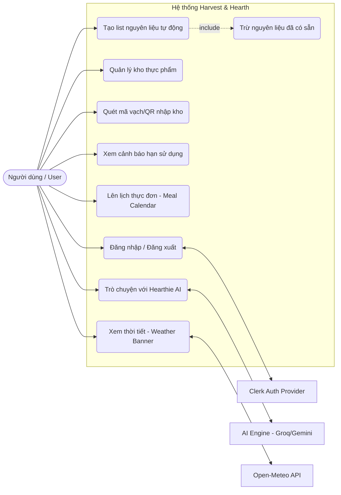
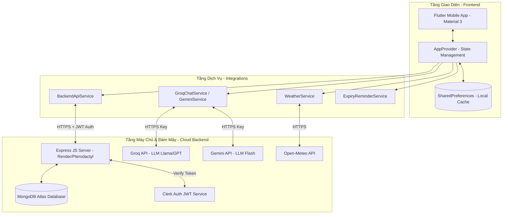
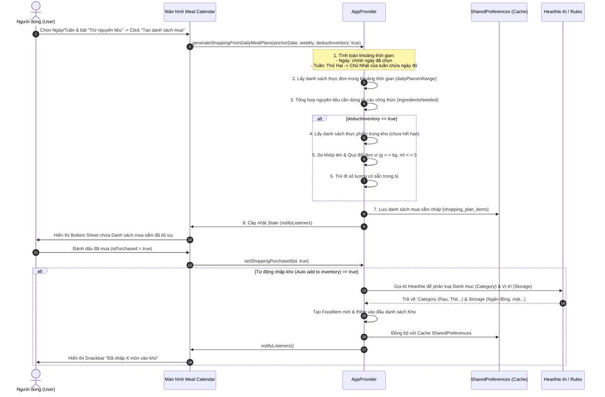
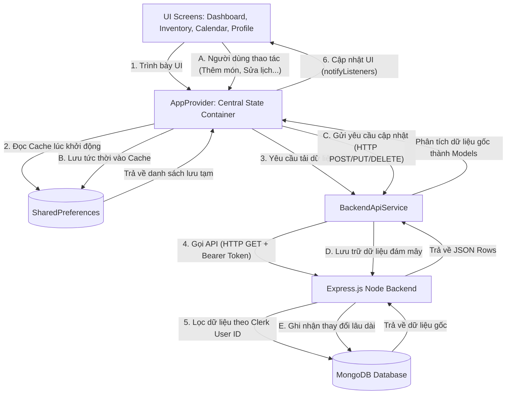

# Báo cáo Thiết kế Hệ thống - Harvest & Hearth

> **Báo cáo đồ án đầy đủ (DOCX):** xem thư mục [`docs/bao-cao-dong-an/`](docs/bao-cao-dong-an/) — file `Harvest-Hearth-Bao-Cao-Dong-An.docx` (12 chương, 15 diagram, khối *Giải thích* in nhỏ). Tái tạo: `powershell -File docs/bao-cao-dong-an/build-report.ps1`.

Tài liệu này chứa các sơ đồ thiết kế chi tiết dưới dạng mã **Mermaid.js**. Bạn có thể xem trực tiếp các sơ đồ được render trên hệ thống hỗ trợ Markdown hoặc sao chép mã Mermaid để sử dụng trong các công cụ vẽ sơ đồ trực tuyến như [Mermaid Live Editor (mermaid.live)](https://mermaid.live).

---

## 1. Sơ đồ Use Case (UML Use Case Diagram)
Mô tả các Actor (Người dùng, Hệ thống xác thực Clerk, AI Engine, Weather API) và các chức năng cốt lõi của ứng dụng **Harvest & Hearth**.

### Mô tả chức năng:
*   **Quản lý kho thực phẩm**: Theo dõi các mặt hàng thực phẩm được phân chia theo khu vực (Ngăn đông, Ngăn mát, Tủ khô).
*   **Lên lịch thực đơn**: Lên kế hoạch ăn uống theo các bữa (Sáng, Trưa, Tối) trên giao diện lịch tháng.
*   **Tạo danh sách mua sắm tự động (Trừ nguyên liệu sẵn có)**: Hệ thống tự động thu thập nguyên liệu từ thực đơn Ngày hoặc Tuần lịch biểu (Thứ Hai đến Chủ Nhật), đối chiếu với lượng thực phẩm đang có trong tủ lạnh (bao gồm quy đổi đơn vị đo lường tương thích) và chỉ đề xuất mua những phần còn thiếu.
*   **Trò chuyện với Hearthie AI**: Trợ lý AI hỗ trợ gợi ý công thức dựa trên thực phẩm sắp hết hạn trong tủ, đưa ra mẹo bảo quản và trả lời các câu hỏi về bếp núc.

---

## 2. Sơ đồ Kiến trúc Hệ thống (System Architecture)
Mô tả kiến trúc phân tầng của ứng dụng từ tầng Giao diện di động, tầng Dịch vụ xử lý logic đến tầng Máy chủ và các dịch vụ bên thứ ba.

### Thành phần kiến trúc:
*   **Frontend**: Ứng dụng Flutter sử dụng kiến trúc State Management bằng **Provider**. Cache cục bộ qua **SharedPreferences** để đảm bảo tốc độ phản hồi nhanh và khả năng hoạt động offline tạm thời.
*   **Backend Server**: Viết bằng **Node.js/Express**, deploy linh hoạt trên **Render** hoặc **Pterodactyl**. Hệ quản trị cơ sở dữ liệu phi quan hệ **MongoDB Atlas** dùng để lưu trữ lâu dài kho thực phẩm và thực đơn của người dùng.
*   **Xác thực và Bảo mật**: Token JWT được tạo từ **Clerk Auth** ở client và được xác thực qua middleware của backend để bảo vệ các API endpoint.

---

## 3. Sơ đồ Tuần tự (Sequence Diagram) - Luồng Danh sách mua sắm thông minh
Minh họa luồng hoạt động chi tiết khi người dùng yêu cầu tạo danh sách nguyên liệu từ thực đơn lịch và tự động đồng bộ ngược lại vào kho sau khi mua.

---

## 4. Sơ đồ Quản lý Trạng thái & Luồng Dữ liệu (State Management & Data Flow)
Biểu diễn cách dữ liệu luân chuyển giữa các màn hình UI, lớp quản lý trạng thái tập trung (`AppProvider`), cơ sở dữ liệu cục bộ và cơ sở dữ liệu đám mây.

